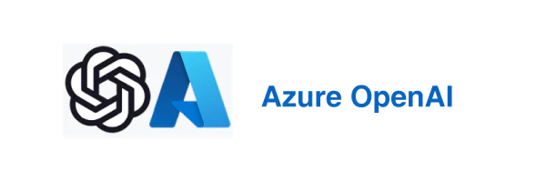

# Overview

This repository a workshop designed to help the team explorer the possibilities of Azure Open AI Services and how they can be used to enhance the product experience. It will focus on Generative AI and how it can be used to generate and analyze text and images. By the end of the workshop participant will have a good understanding of how to use Azure Open AI services and how to integrate them into their applications.

## Prerequisites

- [Visual Studio Code](https://code.visualstudio.com/)
- The [Polyglot Notebook extension](https://marketplace.visualstudio.com/items?itemName=ms-dotnettools.dotnet-interactive-vscode) for Visual Studio Code
- [.NET 8.0 SDK](https://dotnet.microsoft.com/en-us/download)
- Access to an Azure subscription

## Workshops

- [Azure OpenAI](/notebooks/Azure%20Open%20AI%20Workshop.ipynb)

